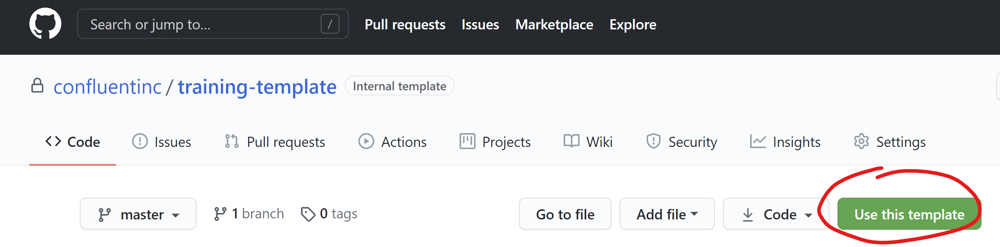
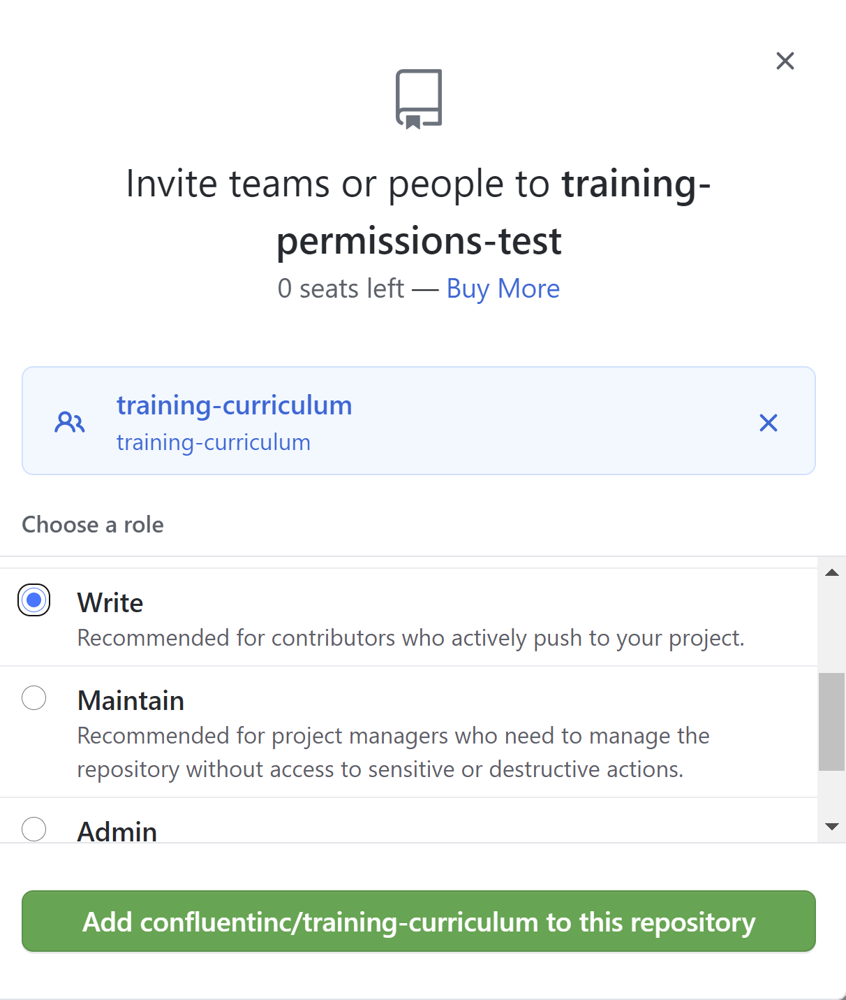

# training-\<role>-\<theme>-\<course>

## Create a New Course from Template

1. Select **Use this template**.
    
2. Create a new private repository.
3. Name the repo according to the naming convention `training-<role>-<theme>-<course>`. See [Roles](#Roles) and [Themes](#Themes).
4. Give `write` access to the `training-curriculum` GitHub team.
    1. Go to **Settings** -> **Manage access** -> **Invite teams or people** and grant the permission.
    1. Here is an example for a repo called "training-permissions-test" that was created from the template:
    

## Introduction

This repository is a template for creating courses that use a role-based design model.

Please see the [GitHub Process Wiki](https://confluentinc.atlassian.net/wiki/spaces/SER/pages/1284343373/GitHub+-+Process) for guidance about how to use git and GitHub during development.


----

## Roles
A "role" is a job that our customers have. Roles are exemplified by [company personas](https://docs.google.com/spreadsheets/d/1M4PabldU4Y39i0mGJNkuw8jmN5AVFN4km3amgMKVmxM/edit#gid=548434155) provided by the UX research team. Here are the abbreviations:
- ADM -- Omar the Operator (yes, this is confusing, but for consistency we use the administrator abbreviation)
- ARCH -- Amy the Architect
- DEV -- Del the Developer
- DATA -- David the Data Steward

## Themes
"Themes" come from the [Professional Services Adoption Framework](https://confluentinc.atlassian.net/wiki/spaces/SER/pages/944900050/Adoption+Framework+Themes). Here are the abbreviations:
- Architecture & Strategy (ARCH)
- Cluster Strategy (CLSTR)
- Data Security and Privacy (PRIV)
- Event Streaming Solution (ESTR)
- Infrastructure and Hosting (INFRA)
- Operational Monitoring (MNTR)
- Operational Performance (PERF)
- Platform Security (SEC)
- Process and Governance (GOV)
- Scaling and Automation (AUTO)

## Course
A "course" is based on what the person in the role would like to accomplish. The course tells a story that guides the student towards their goal through a series of learning activities called "modules." As paradoxical as it can be, modules should stand as independently as possible while also fitting within the course's coherent narrative.


----

## modules

Education modules are written using the AsciiDoctor markup language. See the [AsciiDoc Documentation](https://docs.asciidoctor.org/asciidoc/latest/) to learn how to write adoc files. See the [asciidoc-reference.adoc](./asciidoc-reference.adoc) file for Asciidoctor examples and references.

Components of a module:
* Intro
  * focused on the person, their role, and what they are trying to accomplish
  * "why should I care?"
* Lecture
  * sets the context for the activity
  * what info is necessary for success in the activity?
  * driven by diagrams, images, colors, code samples, not walls of text
* Activity
  * This is the learning experience for the student
  * learn by doing
  * often a lab in the lab VM, but other types of activities are also possible
* Activity Debrief
  * connect what students experienced back to the lecture
  * again driven by images, not walls of text
* Summary
  * Connect back to Intro and summarize how the activity enables the student to accomplish their goal
  * include references to relevant blog posts, documentation, etc.

----

## images

There is one top level images folder that all `adoc` files point to. Eventually the goal is to have a central images repository for all curriculum, but for now it makes sense to store all images in the images directory.

----
## infra

The `infra` directory contains the files necessary to configure a lab VM with the everything necessary to run hands-on lab activities.

### `course-src`
The source files for the course that students will interact with on the VM. The contents of this folder will be automatically downloaded onto the student's VM on startup.

### `MY-INFRA-ID.json`
The json that defines the Infra object that the Lab Portal uses to launch a VM. This defines the AMI, the regions, the session duration, the location of the course-src files on the VM, and which HTML modules are automatically downloaded.

### `packer.json`
The json file that can be used to build a new Amazon Machine Image (AMI) if needed. We use [Packer's amazon-ebs builder](https://www.packer.io/docs/builders/amazon/ebs) with [Packer's ansible provisioner](https://www.packer.io/docs/provisioners/ansible). We use a few "base AMIs" to build from. See https://github.com/confluentinc/training-labs-portal/tree/master/AMIs for more information about the "base AMIs" and the AMI building proces.

### `playbook.yml`
The Ansible playbook configures the VM before Packer packages it into an AMI. See [Ansible's Module Index](https://docs.ansible.com/ansible/2.8/modules/list_of_all_modules.html) to see all off-the-shelf Ansible modules used to configure machines. See Jeff Geerling's [Ansible for DevOps GitHub repo](https://github.com/geerlingguy/ansible-for-devops) and accompanying [Ansible 101 YouTube playlist](https://www.youtube.com/watch?v=goclfp6a2IQ&list=PL2_OBreMn7FqZkvMYt6ATmgC0KAGGJNAN) if you would like to learn more about Ansible.

### `installer.sh`
If you don't want to declare your configuration in the Ansible playbook, you can write an installer script in bash instead.

----

## artifacts

This folder is not in source control because it contains artifacts that are generated from source material (mostly `adoc` files). All final artifacts are stored in Google Drive, currently under `Company -> Training -> training_materials_for_instructors` as a source of truth.

At the course level, we have these artifacts:
* introduction.html
  * What is the story the course tells?
  * "Why does this matter to me?"
  * Aligned with Confluent sales playbooks
* introduction.mp4

Each module has these artifacts:
* this-module.html + images
* lecture.mp4
* activity-walkthrough.mp4
  * full demonstration of all steps of the lab with copious commentary
* activity-debrief.mp4

ILT course contains all the artifacts for each module, but adds:
* slides.pdf (only visible to instructors)
* instructor-guide.pdf (only visible to instructors)
* exercise-book.pdf (and/or html)
* student-handbook.pdf


----

## Building Modules and Lab Environments

Steps:

0. Ask for an API key for the AWS Labs Portal
1. Configure the `edu.py` CLI tool. See the https://github.com/confluentinc/training-tools/tree/master/cli for more information.
2. If you need a custom AMI for this course, build an AMI with Packer. See https://github.com/confluentinc/training-labs-portal/tree/master/AMIs for more information on the AMI building process. Example Packer command:
    ```bash
    $ packer image build -var 'region=us-west-2' infra/packer.json
    ```
3. Build student guide and source zip files and push them to S3. This example builds HTML zips from all adoc files in the `modules/` folder, using the course abbreviation `ADM-SEC-RBAC` and version `6.0.0-v1.0.0`
    ```bash
    $ edu.py --modules modules/*.adoc
             --course ADM-SEC-RBAC
             --version 6.0.0-v1.0.0
    ```
    - To upload to S3, use the `--upload` option and it will upload to `confluent-training-instructions-us-west-2` prefixed with the course and version.
4. Create an `Infra` JSON. See [infra/MY-INFRA.json](infra/MY-INFRA.json). The filename should define the Infra ID (or else use the `--infra-id` option of the `edu.py` tool to override). The output of the previous command will suggest what to put for `"virtual_machine_startup"` so that the HTML will be automatically downloaded onto the student's VM on startup.
5. Post the Infra to the lab portal API. The default Infra ID is the name of the file, but you can override with the `--infra-id` option.
    ```bash
    $ edu.py --post-infra infra/MY-INFRA.josn
    ```
    - Note: during development, you should use the `--infra-id` (or `-inf`) option to create throwaway infras for testing purposes.
        ```bash
        $ edu.py --post-infra infra/MY-INFRA.josn -inf MY-INFRA-TEST
        ```
6. Use the `Infra` ID to create a session via the labs portal API
    ```bash
    $ edu.py --launch-lab --infra-id MY-INFRA
    ```
7. Follow the link returned from the API call to start your session.


## instructor-led-training

This development process should be amenable to easily creating ILT content from modules. ILT has these components:
* exercise-book.adoc
  * composed of module activities
* instructor guide
  * composed of module intros, lectures, activity debriefs, and summaries
  * add more in-depth slides and notes
  * add more interactive elements that can only be done in a classroom setting
  * include notes specifically for the instructor
* student handbook
  * everything in the instructor guide except for the notes specifically for the instructor
* slides
  * everything in the instructor guide, except in 16x9 aspect ratio and no pages of text notes. Only images, diagrams, code samples, and occasionally bulleted text.

These `adoc` files should be able to point directly to existing module content using asciidoctor's `:include:` directive and add ILT-specific content as required.
